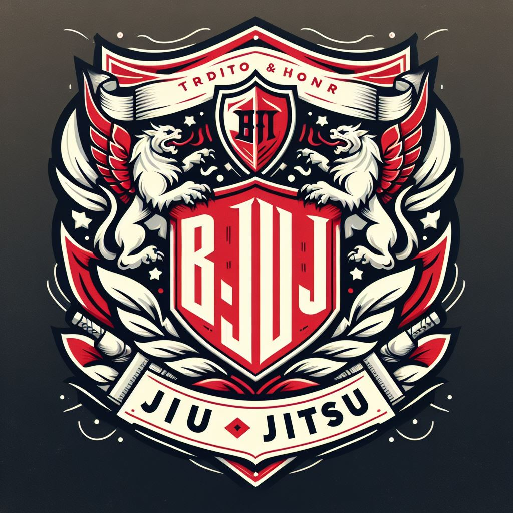

  

Apresentação do App BJIUJ

Bem-vindo ao bjiuj - Sua Plataforma de Jiu-Jitsu! 🥋

O bjiuj é mais que um aplicativo; é uma comunidade dedicada a todos os amantes do Jiu-Jitsu, proporcionando uma experiência única e envolvente. Aqui, os praticantes, professores e academias se encontram para compartilhar, aprender e evoluir juntos.

Recursos Principais
🔄 Perfis Personalizados: Crie seu perfil, destaque suas conquistas, siga outros entusiastas e conecte-se com professores renomados e academias de prestígio.

🌐 Aulas Sob Demanda: Oferecemos uma inovadora plataforma de aulas a pedido! Seja em uma viagem de negócios, férias ou apenas explorando uma nova cidade, você pode encontrar e agendar aulas de Jiu-Jitsu com professores locais.

🏆 Conquistas e Experiências: Compartilhe suas experiências, técnicas favoritas e conquistas com a comunidade. Inspire outros e seja inspirado por histórias de sucesso.

🤝 Conexões Significativas: Estabeleça conexões valiosas com outros membros da comunidade. Aprenda, treine e cresça junto com pessoas que compartilham sua paixão pelo Jiu-Jitsu.

📆 Agenda de Eventos: Fique atualizado sobre eventos, competições e aulas especiais em sua região. Nunca perca uma oportunidade de aprimorar suas habilidades.

Como Funciona
📱 Registro Simples: Cadastre-se facilmente e comece a explorar a comunidade bjiuj em minutos.

🤔 Encontre Professores Locais: Descubra professores de Jiu-Jitsu em sua área e agende aulas personalizadas sob demanda.

🏠 Aulas Onde Você Estiver: Seja em casa, no hotel ou em qualquer lugar, leve suas aulas de Jiu-Jitsu com você para manter-se ativo e em constante evolução.

📣 Compartilhe e Inspire: Compartilhe seus momentos marcantes, técnicas favoritas e histórias inspiradoras para fortalecer a comunidade.

Junte-se à comunidade bjiuj agora e mergulhe em uma experiência única de Jiu-Jitsu, onde cada movimento conta e cada conexão faz a diferença! 🌟🥷

Recursos Exclusivos
🤝 Aulas Particulares com Mestres da Faixa Roxa em Diante: Conecte-se com professores qualificados, a partir da faixa roxa, que oferecem aulas particulares personalizadas. Agende suas aulas de acordo com sua disponibilidade e aprimore suas habilidades.

📅 Agendamento Inteligente: Professores e academias podem gerenciar suas agendas e disponibilizar horários para aulas particulares. Atletas podem facilmente agendar suas sessões diretamente no aplicativo.

📲 QR Code para Controle de Presença: Simplificamos o controle de presença! Professores e academias utilizam QR codes para registrar a presença dos atletas nas aulas. Cada atleta tem acesso ao seu próprio calendário de presença.

🏅 Certificação de Graduação Digital: Atletas podem verificar suas graduações diretamente no aplicativo, facilitando o acompanhamento do progresso e reconhecimento de conquistas.

🤼‍♂️ Pertencimento a Equipes: Cada atleta pertence a uma equipe exclusiva. Fortaleça o espírito de equipe e acompanhe as conquistas coletivas.

🗓️ Calendário de Presenças e Atividades: Professores, academias e atletas têm acesso a um calendário completo, mostrando presenças, eventos e aulas marcadas. Mantenha-se organizado e comprometido com sua prática.

Como Participar
👤 Professores e Academias: Cadastrem-se para oferecer aulas particulares, gerenciar agendas e utilizar o sistema de controle de presença.

🥋 Atletas: Junte-se à comunidade, agende aulas particulares, gerencie sua agenda e acompanhe suas graduações e presenças.

🤼‍♀️ Equipes Unidas: Fortaleça os laços com sua equipe, celebrando conquistas e avanços juntos.

Explore o bjiuj e descubra como estamos transformando a experiência no Jiu-Jitsu. Junte-se a nós e faça parte da próxima era do treinamento personalizado e da comunidade unida! 🚀🤙

#bjiuj #JiuJitsu #ComunidadeBJJ #AprendaJunto #TreineJunto #JiuJitsuRevolution #TreinePersonalizado #AprendaJunto